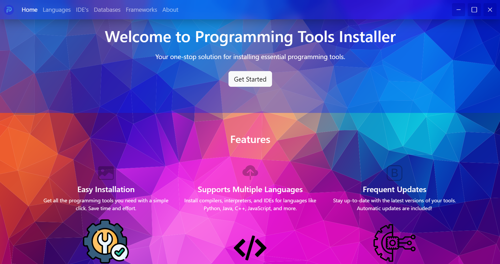

# Programming Tools Installer

The Programming Tools Installer is an Electron-based desktop application that helps developers quickly install and check the versions of popular programming tools and environments. With this app, you can easily install packages or check the versions of tools like Node.js, Python, Java, Go, and many more.

## Features

- **Install Programming Tools**: Easily install tools and environments like Node.js, Python, Java, Go, etc.
- **Check Versions**: Check the version of installed tools with just a click.
- **Command Execution**: Execute common commands such as `node --version` or `python --version` directly from the app.
- **Real-Time Output**: View the output and errors of commands in real-time via an interactive dialog interface.
- **Simple User Interface**: The app provides a clean and intuitive user interface built with Electron, making it easy for both new and experienced developers.

## Tools Supported

The following tools and environments are supported for version checking and installation:

- **Node.js**: `node --version`
- **Python**: `python --version`
- **Java**: `javac --version`
- **Go**: `go --version`
- **C++**: `gcc --version`
- **.NET**: `dotnet --version`
- **MySQL**: `mysql --version`
- **MongoDB**: `mongodb --version`
- **PostgreSQL**: `postgresql --version`
- **Android**: `android --version`
- **Django**: `django-admin --version`
- **React**: `react --version`
- **Electron.js**: `electron --version`

## Installation

### Prerequisites

- **Node.js**: Make sure you have Node.js installed. If not, you can download it from [here](https://nodejs.org/).
- **PowerShell** (Windows): The app uses PowerShell for executing system commands. Ensure it's properly installed on your system (default on Windows).

### Installing the Application

1. Clone this repository:
   ```bash
   git clone https://github.com/helloitsmeabhi/prginst.git

2. Navigate into the project directory:
   ```bash
   cd prginst

3. Install dependencies:
   ```bash
   npm install

4. Run the application:
   ```bash
   npm start

## Usage

1. Open the application after installation.
2. Use the provided interface to select the programming tool you want to check the version for or install.
3. If the tool is already installed, the app will display its version.
4. If the tool is not installed, click the install button to begin the installation process.
5. View real-time output and errors directly in the app’s dialog window.

## Troubleshooting

1. If the app doesn't work as expected, make sure your system has the required tools installed and accessible via the command line.
2. If you're using Windows, ensure that PowerShell is enabled and configured to execute scripts. You can adjust the execution policy
   by running the following command in PowerShell (as administrator):
    ```bash
    Set-ExecutionPolicy RemoteSigned